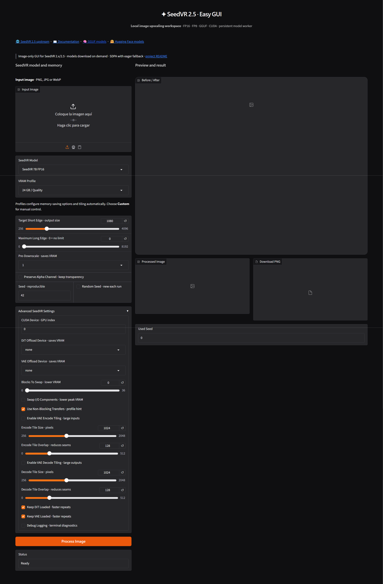

# 🖼️ SeedVR 2.5 · Easy GUI

A local Windows GUI for image upscaling with **SeedVR 2.x/2.5**. It combines a clean Gradio interface, the SeedVR upstream backend, on-demand model downloads, VRAM presets, GGUF support, and a persistent worker for reusing loaded models between inferences.



**Upstream:** [ByteDance-Seed/SeedVR](https://github.com/ByteDance-Seed/SeedVR) · **SeedVR model files:** [model files folder](https://huggingface.co/MonsterMMORPG/Wan_GGUF/tree/main) · **GGUF files:** [GGUF model files](https://huggingface.co/cmeka/SeedVR2-GGUF/tree/main)

> This application exposes the image workflow only. The upstream project may contain additional video-oriented capabilities that are intentionally not exposed here.

## 🧭 Quick Start

| Step | Action |
| :---: | :--- |
| 1 | Run `install.bat` from a writable project folder. |
| 2 | The installer downloads local `uv`, creates `.venv`, prepares the backend and validates PyTorch CUDA/GGUF. |
| 3 | Run `run.bat` and open the local Gradio URL. |
| 4 | Upload an image, select a model/profile and click **Process Image**. |

The default model is **SeedVR 7B FP16**. Model weights are downloaded only when first used. FP16 weights are downloaded from the official ByteDance-Seed model repositories; GGUF weights come from the dedicated SeedVR2-GGUF quantization repository.

## ✨ Features

- Official SeedVR 3B/7B FP16 models and SeedVR GGUF Q4/Q8 quantizations.
- Complete upstream backend with GGUF loading and dequantization.
- Persistent worker for reusing DiT/VAE between inferences.
- VRAM profiles from 4 GB to 48 GB+.
- BlockSwap, CPU offload, VAE tiling and model residency controls.
- SDPA fixed internally with an eager fallback.
- Before/After comparison, preview and PNG download.
- Local self-contained `uv` runtime and project-local caches.

## 🖥️ Requirements

- Windows 10/11 x64, Git for Windows and an up-to-date NVIDIA driver.
- NVIDIA GPU; 8 GB VRAM is a practical minimum with GGUF/BlockSwap.
- 32 GB system RAM minimum.
- Internet access for dependencies and first-time model downloads.

## 📦 Installation

Run `install.bat`. It downloads the local `uv.exe`, creates `.venv`, clones [ByteDance-Seed/SeedVR](https://github.com/ByteDance-Seed/SeedVR), installs the GUI and backend requirements including `gguf`, verifies the GGUF implementation, and checks PyTorch CUDA. It does not download every model during installation.

## 🔁 Inference Workflow

1. Upload an image.
2. Select a SeedVR model and VRAM profile.
3. Set the target short edge, optional long-edge limit, pre-downscale and alpha handling.
4. Click **Process Image**.
5. The app downloads the selected DiT/VAE files if missing, sends the request to the persistent worker and saves the result under `outputs/`.
6. The Before/After slider and download controls present the result in the GUI.

The worker keeps its `runner_cache` alive while the GUI is running. With **Keep DiT Loaded** and **Keep VAE Loaded** enabled, loaded components remain available for subsequent inferences. Closing the GUI releases the worker and GPU memory.

## 🧠 VRAM Profiles

Profiles update the actual backend controls rather than acting as labels. Profiles from 20 GB upward enable model caching; 24 GB, 32 GB and 48 GB+ keep DiT and VAE resident with progressively larger tiles.

## ⚙️ Attention and CUDA

The attention selector is intentionally hidden. The app always sends `--attention_mode sdpa`. If SDPA raises a `RuntimeError` or `NotImplementedError`, the backend falls back to eager attention using matrix multiplication and softmax, and reports it in the console. The console also reports cache settings and backend diagnostics.

## 🎛️ Main Controls

- **SeedVR Model:** model family and precision; GGUF reduces VRAM usage.
- **VRAM Profile:** complete memory and residency preset.
- **Target Short Edge:** target size of the shorter image edge.
- **Maximum Long Edge:** safety limit for very large images.
- **Pre-Downscale:** reduces the input before inference.
- **Preserve Alpha:** keeps transparency when supported.
- **Seed / Random Seed:** reproducible or randomized generation.
- **BlockSwap / Offload:** reduce peak VRAM usage.
- **VAE Tiling:** process large images in overlapping tiles.
- **Keep DiT/VAE Loaded:** retain models in the persistent worker.

## 📁 Project Layout

```text
app/                 GUI, worker and SeedVR adapter
backend/             local upstream SeedVR checkout
models/              on-demand model weights
outputs/             generated PNG files
runtime/uv/          self-contained uv executable
.venv/               project Python environment
temp/                temporary files and caches
```

## 📄 Licensing

Review the upstream [SeedVR license and notices](https://github.com/ByteDance-Seed/SeedVR) and the license terms for each model repository before redistribution or commercial use.
